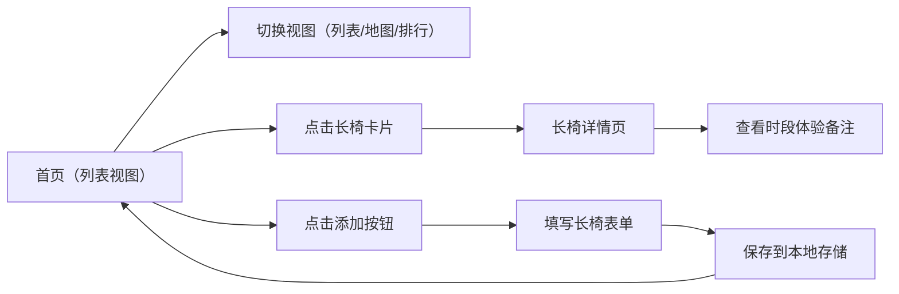

## 1. 产品概述

城市长椅观察档案是一个面向城市漫步爱好者的前端应用，让用户记录和发现城市中那些被忽略的长椅，记录它们的特征和个人体验，打造专属的城市休憩地图。

- 核心价值：帮助用户记录城市长椅信息，发现舒适的休憩角落，记录城市生活的点滴
- 目标用户：城市漫步爱好者、街头观察者、喜欢在城市中寻找安静角落的人
- 产品定位：轻量级个人记录工具，兼具探索与记录双重属性

## 2. 核心功能

### 2.1 用户角色
| 角色 | 注册方式 | 核心权限 |
|------|----------|----------|
| 普通用户 | 无需注册，本地存储 | 记录、浏览、排序、搜索长椅档案 |

### 2.2 功能模块
1. **长椅列表页**：长椅卡片列表，支持筛选和搜索
2. **地图占位视图**：以网格布局展示长椅分布（占位地图）
3. **舒适度排行榜**：按综合舒适度排序的长椅排行
4. **长椅详情页**：长椅详细信息 + 分时段体验备注
5. **添加/编辑长椅**：表单录入长椅信息

### 2.3 页面详情
| 页面名称 | 模块名称 | 功能描述 |
|---------|---------|----------|
| 列表页 | 顶部导航 | Logo、页面切换（列表/地图/排行）、添加按钮 |
| 列表页 | 搜索筛选 | 关键词搜索、材质筛选、朝向筛选 |
| 列表页 | 长椅卡片列表 | 卡片展示长椅缩略信息，点击进入详情 |
| 地图页 | 地图占位视图 | 网格布局展示长椅位置标记 |
| 排行榜页 | 舒适度排行 | 按舒适度降序排列，显示排名和分数 |
| 详情页 | 长椅信息 | 位置、材质、朝向、靠背、遮阴、噪音、停留时长、评分 |
| 详情页 | 时段体验 | 分早中晚等时段的体验备注 |
| 添加页 | 表单录入 | 各项信息输入、评分、时段备注 |

## 3. 核心流程

用户打开应用 → 浏览长椅列表/地图/排行 → 点击查看详情 → 添加新长椅 → 填写信息并保存

## 4. 用户界面设计

### 4.1 设计风格
- **设计理念**：档案手账风格，温暖人文，纸质质感
- **主色调**：暖米色背景（#F5F0E8），深棕文字（#3D352E）
- **辅助色**：苔藓绿（#6B8E5A）、赭石色（#C17F59）
- **按钮风格**：圆角矩形，轻微阴影，悬停有微妙上浮效果
- **字体**：标题使用衬线字体（Noto Serif SC），正文使用无衬线字体
- **布局风格**：卡片式布局，有纸张纹理感，适度留白
- **图标风格**：线性图标，自然温馨

### 4.2 页面设计概览
| 页面名称 | 模块名称 | UI元素 |
|---------|---------|--------|
| 列表页 | 顶部导航 | 圆角导航栏、标签切换、添加按钮 |
| 列表页 | 搜索筛选 | 搜索框、筛选标签、卡片网格 |
| 列表页 | 长椅卡片 | 图片占位、标题、标签、评分、位置 |
| 地图页 | 地图占位 | 网格背景、位置标记点、悬浮信息 |
| 排行榜页 | 排行列表 | 排名徽章、长椅信息、舒适度分数 |
| 详情页 | 信息展示 | 大标题、属性标签、评分展示 |
| 详情页 | 时段体验 | 时段卡片、备注内容、时间标签 |
| 添加页 | 表单 | 表单输入框、下拉选择、评分组件、提交按钮 |

### 4.3 响应式设计
- 桌面端优先，支持移动端自适应
- 卡片网格：桌面端3列，平板2列，手机1列
- 触摸优化：按钮最小尺寸44px，间距适配手指点击

### 4.4 动效设计
- 页面切换：平滑淡入淡出
- 卡片悬停：轻微上浮 + 阴影加深
- 按钮点击：缩放反馈
- 列表滚动：渐次出现动画
