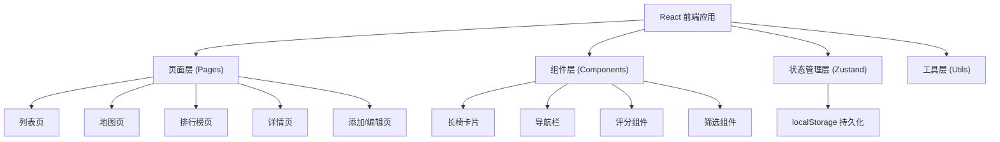
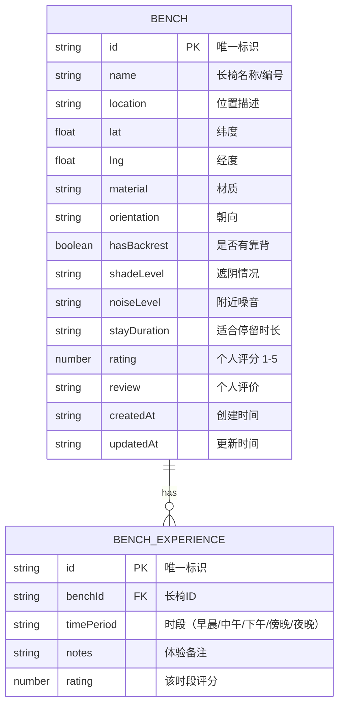

## 1. 架构设计



## 2. 技术栈说明

- **前端框架**：React 18 + TypeScript
- **构建工具**：Vite
- **样式方案**：TailwindCSS 3
- **状态管理**：Zustand
- **路由**：React Router DOM
- **图标库**：Lucide React
- **数据持久化**：localStorage

## 3. 路由定义

| 路由 | 页面 | 说明 |
|------|------|------|
| / | 列表页 | 默认首页，展示长椅列表 |
| /map | 地图页 | 网格地图占位视图 |
| /ranking | 排行榜页 | 按舒适度排序 |
| /bench/:id | 详情页 | 长椅详情 + 时段体验 |
| /add | 添加页 | 新增长椅 |
| /edit/:id | 编辑页 | 编辑长椅信息 |

## 4. 数据模型

### 4.1 数据结构定义



### 4.2 字段说明

**长椅信息 (Bench)**
- `id`: 唯一标识符，UUID 格式
- `name`: 长椅名称，用户自定义
- `location`: 位置文字描述
- `lat`, `lng`: 经纬度坐标（用于地图视图占位）
- `material`: 材质（木质/金属/石质/塑料/混合）
- `orientation`: 朝向（东/南/西/北/东南/东北/西南/西北）
- `hasBackrest`: 是否有靠背
- `shadeLevel`: 遮阴情况（无/部分/完全）
- `noiseLevel`: 噪音等级（安静/一般/嘈杂）
- `stayDuration`: 适合停留时长（<15分钟/15-30分钟/30-60分钟/1小时+）
- `rating`: 综合评分 1-5
- `review`: 个人评价文字

**时段体验 (BenchExperience)**
- `id`: 唯一标识符
- `benchId`: 关联长椅 ID
- `timePeriod`: 时段（早晨/中午/下午/傍晚/夜晚）
- `notes`: 体验备注
- `rating`: 该时段评分

## 5. 舒适度计算

舒适度综合评分算法：
- 靠背权重：20%
- 遮阴权重：20%
- 噪音权重：20%
- 材质权重：15%
- 用户评分：25%

```
舒适度 = 靠背得分*0.2 + 遮阴得分*0.2 + 噪音得分*0.2 + 材质得分*0.15 + 用户评分*0.25
```

## 6. 目录结构

```
src/
├── components/          # 公共组件
│   ├── Layout/         # 布局组件
│   ├── BenchCard/      # 长椅卡片
│   ├── BenchForm/      # 长椅表单
│   ├── Rating/         # 评分组件
│   └── FilterBar/      # 筛选栏
├── pages/              # 页面
│   ├── ListPage/       # 列表页
│   ├── MapPage/        # 地图页
│   ├── RankingPage/    # 排行榜页
│   ├── BenchDetail/    # 详情页
│   └── AddEditPage/    # 添加/编辑页
├── store/              # 状态管理
│   └── useBenchStore.ts
├── types/              # 类型定义
│   └── index.ts
├── utils/              # 工具函数
│   ├── comfort.ts      # 舒适度计算
│   └── storage.ts      # 本地存储
├── data/               # 模拟数据
│   └── mockBenches.ts
├── App.tsx
├── main.tsx
└── index.css
```
